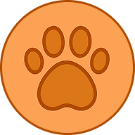

<p align="center">
  
</p>

# 🐾 Patitas Conectadas

## **Patitas Conectadas** es una red social enfocada en crear una comunidad de mascotas, donde los usuarios pueden ver, buscar y crear publicaciones, dar "me gusta" y seguir a otros . Este proyecto está construido con **React**, **Redux Toolkit**, **React Router** y **Ant Design**, ofreciendo una experiencia moderna y responsive.

## 🚀 Despliegue

- **Frontend:** [Vercel](https://vercel.com/)
- **Backend:** Node.js/Express (`http://localhost:8080`)

## 🛠️ Tecnologías utilizadas

- **React**
- **Redux Toolkit**
- **React Router**
- **Ant Design**
- **JavaScript (ES6+)**
- **CSS**
- **LocalStorage** para manejo de sesión
- **Backend Node/Express** (`http://localhost:8080`)

---

## Funcionalidades principales

### 🔐 Autenticación (Login/Register)

- Manejo de sesión con `authSlice`.
- Persistencia del token en `localStorage`.
- Redirección automática al login si no hay sesión activa.

### 🔐 Rutas protegidas

Para evitar que usuarios no autenticados accedan a rutas privadas, se implementa la siguiente lógica del componente PrivateZone:

```js
import { Navigate } from "react-router";
const PrivateZone = ({ children }) => {
  const user = localStorage.getItem("user");
  return user ? children : <Navigate to="/login" />;
};
export default PrivateZone;

Todas las rutas protegidas deben envolverse con PrivateZone, asegurando que solo usuarios logueados puedan acceder.
```

### 🏠 Página principal

- Visualización de todas las publicaciones una vez registrado y logueado.
- Cada post muestra:
  - Carrusel de imágenes.
  - Número de likes y comentarios.
  - Iconos de interacción (like y comentar).

### 📝 Crear publicación

- Generación de formulario con título, cuerpo e imagen.
- Envío de datos con FormData.
- Subida de una imagen por post usando Upload de Ant Design.

### ❤️ Reacciones

- Funcionalidad para dar "me gusta" a publicaciones mediante likePost.
- Actualización dinámica del contador de likes.

### 💭 Comentarios

- Visualización de comentarios por publicación.

### 👤 Perfiles (Profile)

- Ver perfil propio o de otros usuarios.
- Seguir/dejar de seguir usuarios.
- Modal para ver lista de seguidores.
- Publicaciones filtradas por usuario.

### 📲 Diseño responsive

- Header adaptable a pantallas de escritorio y móviles.
- Navegación con íconos de react-icons.

### 🧠 Estado global con Redux Toolkit

Archivo principal: store.jsx

```js
import { configureStore } from "@reduxjs/toolkit";
import auth from "../service/authSlice";
import posts from "../service/post/postSlice";
import follow from "../service/followers/followSlice";
export const store = configureStore({
  reducer: {
    auth,
    posts,
    follow,
  },
});
```

#### Principales slices:

- authSlice: login, logout y usuario actual.
- postSlice: crear publicaciones, obtener todas, likes.
- followSlice: seguir/dejar de seguir usuarios y obtener info del usuario actual.

### 📦 Instalación y uso

Clona el repositorio:

```
bash
Copy
Edit
git clone https://github.com/tu_usuario/patitas-conectadas.git
cd patitas-conectadas
Instala dependencias:
bash
Copy
Edit
npm install
npm i axios
npm install react-router-dom
npm install @reduxjs/toolkit react-redux
npm install antd
Ejecuta el proyecto:
bash
Copy
Edit
npm run dev
```

Asegúrate de tener corriendo el backend en http://localhost:8080.

### 🧪 Posibles mejoras futuras

- Subida múltiple de imágenes.
- CRUD completo de comentarios.
- Integración de chat o mensajes privados.
- Soporte para modo oscuro.

### 🐶 Despedida

Esperamos que disfrutes mucho de tu experiencia en nuestra comunidad, y que conectes con otras mascotas especiales.
Galleta, Bigotes, Nube, Coco, y muchas otras mascotas te esperan en nuestra red :pies:
